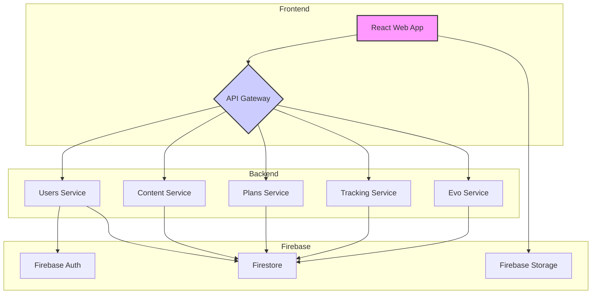

# Arquitetura do Sistema - EvolveYou

## Diagrama de Arquitetura


```
```
```


## Descrição dos Componentes

### Frontend

-   **React Web App**: A interface do usuário principal, construída com React, Vite e Tailwind CSS. É responsável por renderizar todas as telas e interagir com o backend através da API Gateway.

### Backend

-   **API Gateway**: O ponto de entrada para todas as requisições do frontend. É responsável por roteamento, autenticação, rate limiting e outras tarefas transversais.
-   **Users Service**: Gerencia todas as operações relacionadas a usuários, como cadastro, login, perfis e onboarding.
-   **Content Service**: Fornece todo o conteúdo da aplicação, como exercícios, receitas e informações nutricionais.
-   **Plans Service**: Responsável por gerar os planos de treino e dieta personalizados para cada usuário.
-   **Tracking Service**: Armazena e processa os dados de progresso do usuário, como peso, treinos realizados e refeições consumidas.
-   **Evo Service**: O serviço de inteligência artificial, que utiliza o algoritmo GMB aprimorado para personalizar os planos e fornecer o coach virtual EVO.

### Firebase

-   **Firebase Auth**: Utilizado para autenticação de usuários, suportando e-mail/senha e provedores de redes sociais.
-   **Firestore**: O banco de dados NoSQL principal, utilizado por todos os microserviços para armazenar os dados da aplicação.
-   **Firebase Storage**: Utilizado para armazenar arquivos, como as fotos de perfil dos usuários e os vídeos de demonstração dos exercícios.


